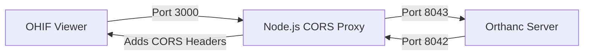

# Orthanc + OHIF Integration Guide: Enabling Segmentation Tools

## Executive Summary
This technical report details the complete configuration required to set up a local Orthanc PACS server that fully supports the OHIF Viewer's advanced features, specifically **Segmentation Tools**.

The core challenge addressed is that **Orthanc does not natively support CORS (Cross-Origin Resource Sharing)**, which is required for modern web-based viewers like OHIF to access data. Additionally, specific metadata configurations are required for segmentation layers to load correctly.

## 1. Architecture Overview

To bypass browser security restrictions (CORS), we implement a "Sidecar Proxy" architecture:



- **Orthanc (8042)**: The raw DICOM server.
- **Proxy (8043)**: Forwards requests to Orthanc and adds `Access-Control-Allow-Origin: *` headers to responses.
- **OHIF (3000)**: Connects *only* to the Proxy (8043).

---

## 2. Orthanc Installation & Configuration

### 2.1 Installation
1. Download the **Orthanc for Windows** installer (64-bit).
2. Install to the default location: `C:\Program Files\Orthanc Server`.
3. Ensure the **DICOMWeb** plugin is selected during installation.

### 2.2 Core Configuration (`orthanc.json`)
File Location: `C:\Program Files\Orthanc Server\Configuration\orthanc.json`

**Critical Changes:**
1. **Enable Remote Access**: Allows the proxy (and other machines) to connect.
   ```json
   "RemoteAccessAllowed" : true,
   "AuthenticationEnabled" : false,  // For local dev only
   ```

### 2.3 DICOMWeb Configuration (`dicomweb.json`)
File Location: `C:\Program Files\Orthanc Server\Configuration\dicomweb.json`

**Critical Changes for Segmentation:**
By default, Orthanc sends simplified JSON. OHIF requires **Full** metadata to render segmentations and multi-frame images correctly.

```json
{
    "DicomWeb" : {
        "Enable" : true,
        "Root" : "/dicom-web/",
        "EnableWado" : true,
        "WadoRoot" : "/wado",
        "Ssl" : false,

        // CRITICAL FOR SEGMENTATION:
        "StudiesMetadata" : "Full",
        "SeriesMetadata" : "Full"
    }
}
```
*Note: The `EnableCors` setting often seen in guides does NOT work for the standard Windows installer version of Orthanc, necessitating the proxy solution below.*

---

## 3. The CORS Proxy Solution

Since Orthanc cannot serve CORS headers, we run a lightweight Node.js script to intercept traffic.

### 3.1 Proxy Script (`orthanc-cors-proxy.js`)
Create this file in your project root. It uses standard Node.js libraries (no `npm install` required).

```javascript
const http = require('http');
const url = require('url');

const PROXY_PORT = 8043;
const ORTHANC_URL = 'http://localhost:8042';

const server = http.createServer((req, res) => {
    const parsedUrl = url.parse(req.url);

    // 1. Handle Preflight (OPTIONS) requests
    if (req.method === 'OPTIONS') {
        res.writeHead(204, {
            'Access-Control-Allow-Origin': '*',
            'Access-Control-Allow-Methods': 'GET, POST, PUT, DELETE, OPTIONS',
            'Access-Control-Allow-Headers': 'Content-Type, Authorization, X-Requested-With',
        });
        res.end();
        return;
    }

    // 2. Forward Request to Orthanc
    const options = {
        hostname: 'localhost',
        port: 8042,
        path: parsedUrl.path,
        method: req.method,
        headers: req.headers,
    };

    const proxyReq = http.request(options, (proxyRes) => {
        // 3. Add CORS headers to the RESPONSE from Orthanc
        const headers = { ...proxyRes.headers };
        headers['Access-Control-Allow-Origin'] = '*';
        headers['Access-Control-Allow-Methods'] = 'GET, POST, PUT, DELETE, OPTIONS';
        headers['Access-Control-Allow-Headers'] = 'Content-Type, Authorization, X-Requested-With';
        headers['Access-Control-Expose-Headers'] = 'Content-Type, Content-Length';

        res.writeHead(proxyRes.statusCode, headers);
        proxyRes.pipe(res);
    });

    req.pipe(proxyReq);
});

server.listen(PROXY_PORT, () => {
    console.log(`CORS Proxy running on http://localhost:${PROXY_PORT}`);
});
```

---

## 4. OHIF Viewer Configuration

We must tell OHIF to talk to the **Proxy (8043)**, not directly to Orthanc.

### 4.1 Config File (`default.js`)
File Location: `platform/app/public/config/default.js`

**Critical Changes:**

1. **Disable Cross-Origin Warning**:
   ```javascript
   showWarningMessageForCrossOrigin: false,
   ```

2. **Data Source Configuration**:
   Update the `orthanc` data source to use port `8043`.

   ```javascript
   {
       namespace: '@ohif/extension-default.dataSourcesModule.dicomweb',
       sourceName: 'orthanc',
       configuration: {
           friendlyName: 'Local Orthanc (via Proxy)',
           name: 'Orthanc',

           // POINT TO PROXY (8043), NOT ORTHANC (8042)
           wadoUriRoot: 'http://localhost:8043/wado',
           qidoRoot: 'http://localhost:8043/dicom-web',
           wadoRoot: 'http://localhost:8043/dicom-web',

           qidoSupportsIncludeField: true,
           imageRendering: 'wadors',
           thumbnailRendering: 'wadors',
           enableStudyLazyLoad: true,

           // Required for some DICOMWeb implementations
           omitQuotationForMultipartRequest: true,
       }
   }
   ```

---

## 5. Startup Procedure

To start the system, you must run the services in this specific order:

1.  **Start Orthanc Service**:
    *   Windows Services -> Orthanc -> Start
    *   *Or via script:* `net start orthanc` (Admin required)

2.  **Start CORS Proxy**:
    *   `node orthanc-cors-proxy.js`
    *   *Verify:* Open `http://localhost:8043/app/explorer.html` (Should load Orthanc UI)

3.  **Start OHIF Viewer**:
    *   `npm run dev`
    *   *Verify:* Open `http://localhost:3000`

## 6. Verification Checklist

If everything is working:
1.  **Study List**: Loads without "Network Error" or CORS console errors.
2.  **Images**: Images load in the viewport.
3.  **Segmentation**:
    *   You can create a segmentation.
    *   You can load existing DICOM-SEG files.
    *   *Note: If segmentations fail to load, double-check `StudiesMetadata: "Full"` in `dicomweb.json`.*

---
**Generated by Antigravity**
